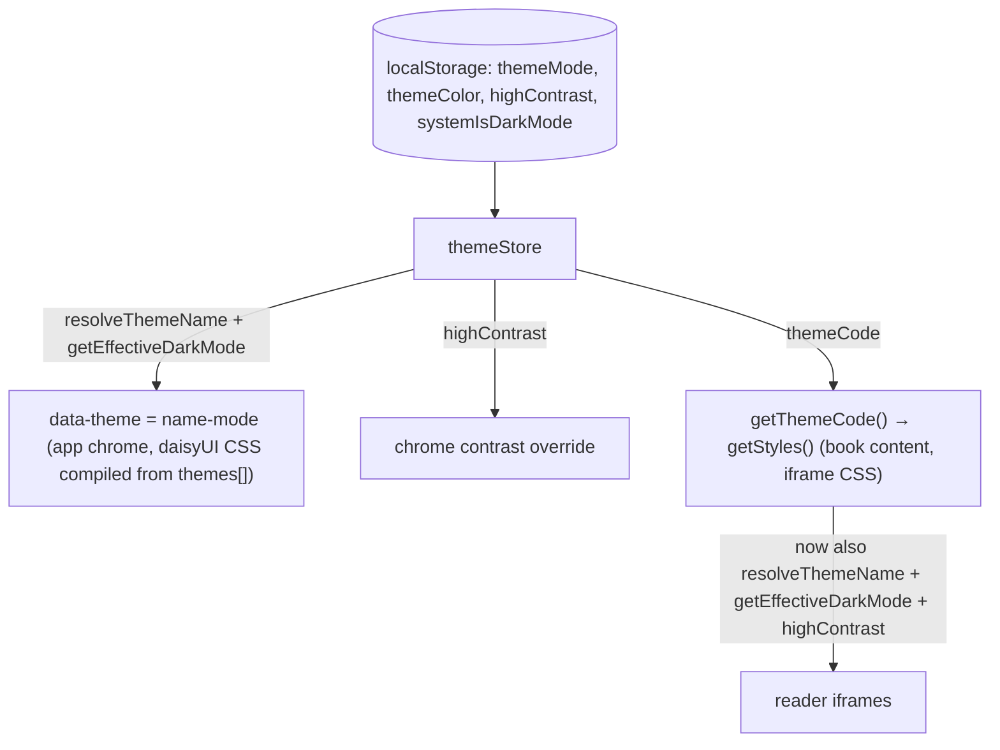

# feat: Theme settings redesign — default appearance, scene cards, high contrast

## Summary

Rework the Color settings theme section into a "Select a default appearance" row (always-interactive mode controls with a squash-and-stretch auto button) plus a masonry grid of four mode-locked scene-artwork cards and Custom. Introduce a hidden dual-mood `default` theme that the cards override, remove sepia/ink/contrast with migration, and add a High Contrast toggle that layers over any theme (defaulting on for e-ink).

## Problem Frame

Today the picker shows seven flat swatches and the mode selector is hidden entirely while a fixed-mood theme is active, leaving users with no visible way back. The AmpleRead direction treats themes as scenes with artwork (see origin doc for the full frame). Two repo realities shape the work: daisyUI theme CSS is compiled at build time from `apps/readest-app/src/styles/themes.ts`, so the implicit default must be a real theme entry; and book content styling (`getThemeCode`) currently bypasses both legacy-name resolution and mood locks, which would make locked themes visibly inconsistent between chrome and reader.

---

## Requirements

Mirrors origin R1–R14 (see `apps/readest-app/docs/brainstorms/2026-07-04-theme-settings-redesign-requirements.md`), with three decisions resolved since:

- No migration for legacy `paper` selections — AmpleRead is pre-release; existing `paper` values simply become the light-locked Paper card.
- Internal names: the hidden dual-mood default theme is `default`; the light-locked card keeps `paper`.
- On e-ink devices High Contrast defaults to **on** (replacing the old auto-selected `contrast` theme), so theme switching stays one action.

---

## Key Technical Decisions

- **`default` is a real, picker-hidden theme entry.** Dual-mood, seeded from paper's light/dark palettes, added to `themes[]` in `apps/readest-app/src/styles/themes.ts` with a flag (e.g. `hidden`) that the picker filters on. This keeps the build-time daisyUI theme generation (`tailwind.config.ts` iterates `themes`) and the `data-theme="${name}-${mode}"` mechanism unchanged — no special-case sentinel value anywhere. `resolveThemeName()` maps `sepia`/`ink`/`contrast` → `default` and its unknown-name fallback changes from `paper` to `default`.
- **High Contrast is theme-store state, not a theme.** A `highContrast` boolean in `apps/readest-app/src/store/themeStore.ts`, persisted to localStorage alongside `themeMode`/`themeColor`, feeding both rendering paths: a chrome-side palette override and a boosted `themeCode` for book content. E-ink initializes it to true. Loading a persisted `contrast` theme flips it on (this migration lives in the store, since the name→name alias map can't carry the side effect).
- **Book-content theming adopts `resolveThemeName()` + `getEffectiveDarkMode()`.** `getThemeCode()` in `apps/readest-app/src/utils/style.ts` currently reads raw localStorage and ignores mood locks — a pre-existing inconsistency that becomes user-visible with mode-locked cards, so fixing it is in scope.
- **Escape hatch uses existing store setters — no new state.** Selecting a locked card never touches `themeMode`, so it survives as the "previous preference": re-tap → `setThemeColor('default')`; toggle click → `setThemeColor('default')` + `setThemeMode(light|dark)`; auto click → `setThemeColor('default')` + `setThemeMode('auto')`.
- **Masonry via CSS, no library.** `columns-2` + `break-inside-avoid` (or grid row-spans if column ordering reads wrong in practice — implementer's call). No masonry pattern exists in the repo; this introduces one.
- **Squash-and-stretch as CSS keyframes in `globals.css`.** Matches the repo's animation convention (keyframes in `apps/readest-app/src/styles/globals.css`, Tailwind utilities, `motion-reduce` guards). No animation library.
- **Card artwork as static images.** Plain `` following the `public/images/theme-toggle/` precedent (`images.unoptimized` is set anyway).

---

## High-Level Technical Design

Theme state and how it reaches the two rendering paths after this change:



Selection states and transitions (the escape hatch):

```mermaid
stateDiagram-v2
  [*] --> Default: initial / reset / migration
  Default --> Locked: select scene card (themeMode untouched)
  Default --> Custom: select custom theme
  Locked --> Default: re-tap card (keep themeMode)
  Locked --> Default: toggle click (themeMode = toggled-toward)
  Locked --> Default: auto click (themeMode = auto)
  Locked --> Locked: select another scene card
  Custom --> Locked: select scene card
  note right of Default: follows system/light/dark with default (paper) palettes
  note right of Locked: effective mode = card mood; toggle shows mood, stays interactive
```

---

## Implementation Units

### U1. Theme model rework in themes.ts

- **Goal:** `themes[]` becomes: `default` (hidden, dual-mood, paper seeds), `paper` (light-locked, scene), `desert-sunset` (light-locked), `starry-night` (dark-locked), `night-pond` (dark-locked); sepia/ink/contrast removed; legacy names resolve to `default`.
- **Requirements:** R5, R7, R10, R12.
- **Dependencies:** none.
- **Files:** `apps/readest-app/src/styles/themes.ts`, `apps/readest-app/src/__tests__/styles/ampleThemes.test.ts` (this file hard-codes the current 7-theme list, mood map, and alias behavior — it is the spec to rewrite). `tailwind.config.ts` derives daisyUI themes from `themes[]` automatically; no edit expected.
- **Approach:** add a `hidden?: boolean` (or similar) field to `Theme`; give `paper` `mood: 'light'` and a `scene` field; point `LEGACY_THEME_ALIASES` for `sepia`/`ink`/`contrast` at `default`; change `resolveThemeName()`'s fallback to `default`. Audit other `themes[]` consumers that don't filter: the reader footer-bar swatch strip (`apps/readest-app/src/app/reader/components/footerbar/ColorPanel.tsx`) will otherwise render the hidden `default` entry — filter `hidden` there too (one-line change; its redesign stays deferred).
- **Execution note:** test-first — rewrite `ampleThemes.test.ts` expectations before touching `themes.ts`.
- **Test scenarios:**
  - Theme list contains exactly the five names above with `default` flagged hidden and the mood map `{paper: light, desert-sunset: light, starry-night: dark, night-pond: dark}` (`default` dual-mood).
  - `resolveThemeName`: `sepia`→`default`, `ink`→`default`, `contrast`→`default`, unknown string→`default`, `paper`→`paper`, scene names pass through, old pre-AmpleRead aliases still resolve.
  - `getEffectiveDarkMode`: `default` follows themeMode + system across the full matrix; locked themes ignore themeMode.
  - WCAG contrast assertions (fg/bg ≥ 4.5, primary/bg ≥ 3.0) hold for every remaining theme × mode.
- **Verification:** `pnpm test -- src/__tests__/styles/ampleThemes.test.ts` green; app builds (daisyUI classes regenerate).

### U2. themeStore: default fallback, highContrast state, migrations

- **Goal:** the store understands `default`, owns the `highContrast` flag, and migrates `contrast` users and e-ink defaults.
- **Requirements:** R10, R12, R13; origin AE4.
- **Dependencies:** U1.
- **Files:** `apps/readest-app/src/store/themeStore.ts`, theme-store test file under `apps/readest-app/src/__tests__/` (run via `pnpm test`, not bare vitest — known localStorage crash otherwise).
- **Approach:** add `highContrast` + `setHighContrast` with localStorage persistence; include it in `themeCode` recomputation so the reader restyles on toggle. `getInitialThemeColor`: e-ink default changes from `'contrast'` to `'default'` with `highContrast` initialized true on e-ink (`window.__READEST_IS_EINK`), false elsewhere. When the persisted raw `themeColor` is `contrast`, set `highContrast` true during init (before alias resolution discards the name).
- **Test scenarios:**
  - Covers AE4. Persisted `themeColor='contrast'` → after init, themeColor is `default` and highContrast is true.
  - Fresh non-eink init → `default` + highContrast false; fresh e-ink init → `default` + highContrast true.
  - `setHighContrast(true)` persists to localStorage and recomputes `themeCode`.
  - `setThemeColor('starry-night')` leaves `themeMode` untouched; `isDarkMode` becomes true even when `themeMode='light'`.
- **Verification:** store tests green; no new failures vs. baseline.

### U3. getThemeCode consistency fix (book content honors locks and migration)

- **Goal:** reader iframes agree with app chrome for locked themes, legacy names, and the new default.
- **Requirements:** R7, R10, R12.
- **Dependencies:** U1.
- **Files:** `apps/readest-app/src/utils/style.ts` (`getThemeCode`, ~line 798), `apps/readest-app/src/__tests__/utils/style-dom.test.ts`.
- **Approach:** `getThemeCode()` resolves the stored name through `resolveThemeName()` and computes dark mode via `getEffectiveDarkMode()` instead of its own themeMode arithmetic. Consumers (`FoliateViewer`, `FootnotePopup`, `clipOptions`) are unchanged.
- **Test scenarios:**
  - Stored `sepia` → default palette returned, no crash.
  - Stored `starry-night` with `themeMode='light'` → `isDarkMode` true (mood lock wins).
  - Stored `default` with `themeMode='auto'` + `systemIsDarkMode=true` → dark palette.
- **Verification:** `pnpm test -- src/__tests__/utils/style-dom.test.ts` green.

### U4. High Contrast application (chrome + book content)

- **Goal:** the `highContrast` flag visibly boosts contrast on any active theme in both rendering paths.
- **Requirements:** R13; origin AE5.
- **Dependencies:** U2, U3.
- **Files:** `apps/readest-app/src/hooks/useTheme.ts` and/or `apps/readest-app/src/styles/globals.css` (chrome side), `apps/readest-app/src/utils/style.ts` (book side), a small transform helper co-located with palette code in `apps/readest-app/src/styles/themes.ts`, plus tests beside the palette tests.
- **Approach (directional, not prescriptive):** a pure helper takes the effective palette + mode and returns a boosted variant — force `base-content` toward pure black/white for the mode and push fg/bg toward a ≥7:1 ratio (tinycolor readability helpers already in repo). Chrome: apply via a `data-high-contrast` root attribute with CSS variable overrides, or an injected style following the `applyCustomTheme()` pattern — implementer's call. Book content: `getThemeCode()` returns the boosted fg/bg when the flag is set, which flows through existing `getStyles()` injection.
- **Test scenarios:**
  - Covers AE5. Boosted night-pond dark palette: fg/bg contrast ≥ 7:1 while bg stays recognizably night-pond (not forced to pure black).
  - Transform is idempotent and pure (same input → same output, input not mutated).
  - Toggling the flag updates `themeCode` so `FoliateViewer` restyles (store-level assertion, U2 test file).
- **Verification:** palette/transform tests green; manual check in `pnpm dev-web` on light + dark themes and e-ink mode.

### U5. ThemeModeSelector: copy + squash-and-stretch auto button

- **Goal:** the mode row reads "Select a default appearance" with a "(System/Light/Dark)" hint, and the auto button reacts rubber-like on click.
- **Requirements:** R1, R2, R3.
- **Dependencies:** none (parallel to U1–U4); builds on the uncommitted sky-pill polish, which must be committed first.
- **Files:** `apps/readest-app/src/components/settings/color/ThemeModeSelector.tsx`, `apps/readest-app/src/styles/globals.css` (keyframes).
- **Approach:** replace the `SettingLabel` text with the heading + small hint (i18n key-as-content). Add a `squash-stretch` keyframe set (scaleX/scaleY overshoot — e.g. squash to ~1.2/0.8 then overshoot ~0.9/1.1 then settle) triggered by re-adding an animation class on click (restart via key bump or `animationend` cleanup); guard with `motion-reduce:animate-none` per repo convention. The animation plays on every auto-button click, including clicks that also fire the escape hatch.
- **Test scenarios:**
  - Component renders new heading and hint text; auto button keeps `aria-pressed`, pill keeps `role='switch'`/`aria-checked`.
  - Clicking auto fires `onThemeModeChange('auto')` and applies the animation class; class clears on `animationend` (jsdom: assert class toggling, not visuals).
- **Verification:** component test green; visual sign-off in `pnpm dev-web` (user eyeballs animation feel before commit, per working agreement).

### U6. ColorPanel: always-visible mode row, escape hatch, High Contrast row

- **Goal:** wire the new interaction model — mode controls never hide, act as return-to-default when a locked card is active, and a High Contrast switch appears.
- **Requirements:** R3, R4, R11, R13; origin AE1, AE2, AE3.
- **Dependencies:** U1, U2, U5.
- **Files:** `apps/readest-app/src/components/settings/ColorPanel.tsx`, `apps/readest-app/src/services/commandRegistry.ts`, component test under `apps/readest-app/src/__tests__/components/settings/`.
- **Approach:** drop the `activeThemeMood` hide condition (line 230); wrap `onThemeModeChange` so that when the active theme is mood-locked it first sets `themeColor` to `default` then applies the requested mode; pass a deselect handler for card re-tap. Use `SettingsSwitchRow` for the High Contrast row (the two neighboring toggles use an older inline pattern — leave them). Update `commandRegistry.ts` entries: rename the "Theme Mode" label/keywords to the appearance copy, add a High Contrast entry, and drop the stale "Background Image" entry. Reset handler: `default` + `auto` + platform-appropriate highContrast default.
- **Test scenarios:**
  - Covers AE1. Starry Night active + toggle click → `themeColor='default'`, `themeMode='light'`.
  - Covers AE2. Desert Sunset active + auto click → `themeColor='default'`, `themeMode='auto'`.
  - Covers AE3. Night Pond active (prior `themeMode='auto'`) + card re-tap → `themeColor='default'`, `themeMode` still `auto`.
  - Mode row renders even while a locked theme is active; dual-mood/custom themes route mode changes straight through (no deselect).
  - High Contrast row toggles store state; reset restores defaults including e-ink variant.
- **Verification:** component tests green; command palette finds the renamed entries.

### U7. ThemeColorSelector: masonry scene-artwork cards

- **Goal:** the picker becomes the mockup's masonry grid — artwork cards with name-pill radios, a dashed Custom tile, and re-tap-to-deselect.
- **Requirements:** R5, R6, R8, R9; plus the cards-section heading "Prefer something different? Create your own theme".
- **Dependencies:** U1 (theme list + hidden flag); artwork paths from U8 (placeholders acceptable until assets land).
- **Files:** `apps/readest-app/src/components/settings/color/ThemeColorSelector.tsx`, component test under `apps/readest-app/src/__tests__/components/settings/`.
- **Approach:** filter out `hidden` themes; preset cards render their artwork image with a pill (theme name + radio indicator) overlaid top-right per mockup; user custom themes keep swatch-style cards (no artwork); Custom tile stays dashed-with-plus. Selected card re-tap calls the deselect handler from U6. Masonry per KTD (CSS columns first). E-ink: `eink-bordered` cards, selection must not rely on shadow/color alone (keep the border-current ring + checked radio).
- **Test scenarios:**
  - Renders exactly the four preset cards (no `default`), any custom themes, and the Custom tile.
  - Radio semantics preserved (checked state, `aria-label`, keyboard Enter/Space).
  - Clicking an unselected card fires `onThemeColorChange`; clicking the selected card fires the deselect handler instead.
  - Section heading renders the new copy.
- **Verification:** component tests green; visual + e-ink check in `pnpm dev-web`.

### U8. Asset relocation and wiring

- **Goal:** card artwork ships from the app's public images path, and `dump/` stops being a runtime dependency.
- **Requirements:** R14.
- **Dependencies:** U7; blocked on the user supplying the four artwork files.
- **Files:** new `apps/readest-app/public/images/theme-cards/` (four artwork files), `apps/readest-app/src/components/settings/color/ThemeColorSelector.tsx` (final src paths); originals archived under `dump/assets/` subfolders.
- **Approach:** follow the `/images/theme-toggle` constant pattern; prefer SVG or 2x-resolution raster (images are unoptimized). Keep filenames kebab-cased matching theme names (`paper.svg`, `desert-sunset.svg`, …) so the card src derives from the theme name.
- **Test scenarios:** Test expectation: none — static asset move; covered by U7's render test once paths are real.
- **Verification:** cards show artwork in `pnpm dev-web`; no references to `dump/` from `src/`.

---

## Scope Boundaries

Carried from origin:

- Other mode-cycle entry points (`ViewMenu`, reader footer bar `ColorPanel`, library `SettingsMenu`, command-palette cycle) stay as-is; they keep cycling `themeMode`, which is harmless under the new model (locked themes ignore it) but not yet escape-hatch-aware.
- Per-theme ambient effects (`scene.atmospherePreset`) remain Phase 2.
- No artwork/masonry treatment for user custom themes; the Custom tile stays a dashed card.
- i18n extraction deferred until WIP commits land (key-as-content renders English meanwhile).

### Deferred to Follow-Up Work

- Make the mode-cycle entry points above escape-hatch-aware (deselect locked theme like U6 does).
- Reader footer-bar theme strip redesign to match the new card model.
- Migrate ColorPanel's two legacy hand-rolled toggles (Invert Image, Override Book Color) to `SettingsSwitchRow`.

---

## Risks & Dependencies

- **Artwork delivery** blocks U8 (and final U7 polish). Everything else proceeds with placeholders.
- **Uncommitted working-tree changes** (`ThemeModeSelector.tsx` polish + user tweaks) must be committed before U5 starts; check `git diff` first — the user edits files directly.
- **Baseline test noise:** ~387 pre-existing failures + 7 tsgo errors unrelated to this work. Verify with targeted test files and "no new failures", not full-suite green.
- **Build-time coupling:** removing themes changes generated daisyUI CSS; any hardcoded `data-theme` values (e.g. `contrast-*` in the untracked playground page) will silently lose styling — dev-only, acceptable.

---

## Sources

- Origin requirements: `apps/readest-app/docs/brainstorms/2026-07-04-theme-settings-redesign-requirements.md` (mockup `dump/img_r22.png`)
- Theme pipeline: `apps/readest-app/src/styles/themes.ts` (`resolveThemeName` ~212, `getEffectiveDarkMode` ~221, `applyCustomTheme` ~291), `apps/readest-app/src/store/themeStore.ts` (e-ink default line ~62, system listener ~172), `tailwind.config.ts` (build-time daisyUI generation)
- Book-content path: `apps/readest-app/src/utils/style.ts` (`getThemeCode` ~798, `getStyles` ~835), `apps/readest-app/src/app/reader/components/FoliateViewer.tsx` (themeCode watch ~100)
- Test spec of current behavior: `apps/readest-app/src/__tests__/styles/ampleThemes.test.ts`
- Settings primitives & conventions: `apps/readest-app/src/components/settings/primitives/`, `apps/readest-app/DESIGN.md`, e-ink rules in `apps/readest-app/src/styles/globals.css`
- Command palette registry: `apps/readest-app/src/services/commandRegistry.ts` (~335–400)
- Animation conventions: keyframes in `apps/readest-app/src/styles/globals.css`, `motion-reduce` usage in `apps/readest-app/src/components/settings/color/ThemeModeSelector.tsx`
