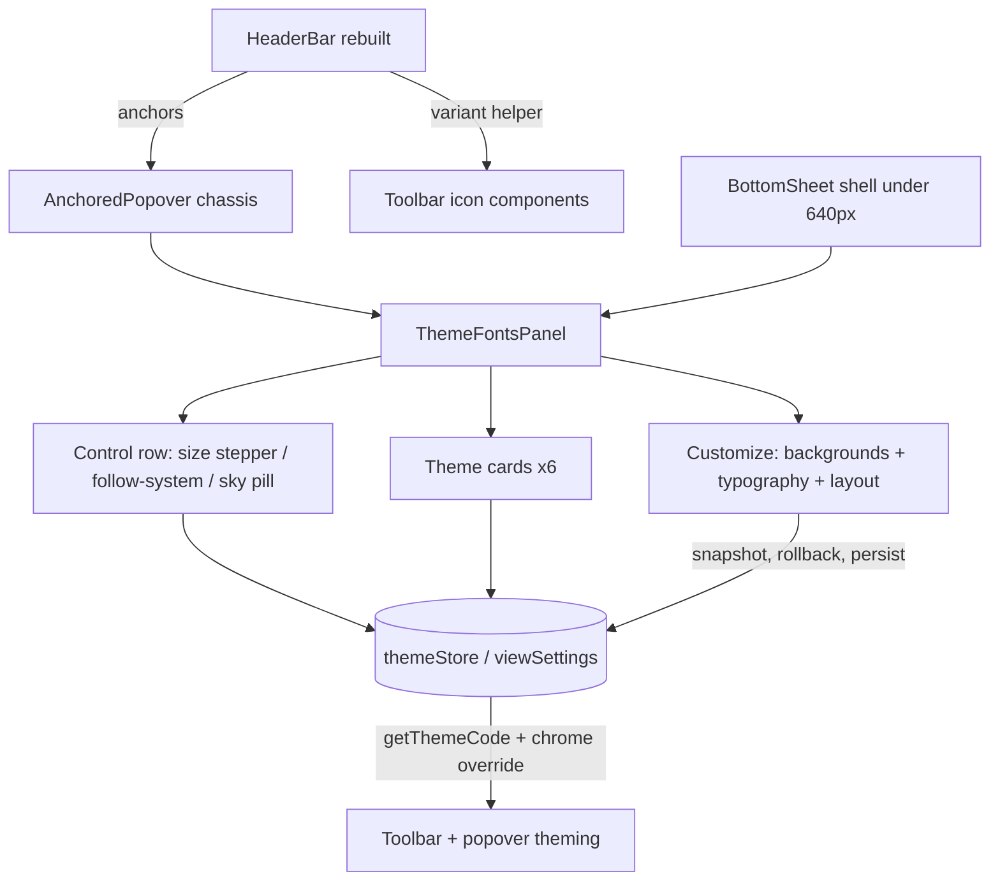

# feat: AmpleRead toolbar and Theme & Fonts popover

## Summary

Rebuild the reader header bar for large screens around seven illustrated, scene-themed toolbar items, and ship the Theme & Fonts surface — an anchored popover (compact + Customize states) that replaces the settings dialog's Font/Layout/Color panels and renders as a bottom sheet on phones. Expand the theme set to six dual-mood themes (Forest Pond reworked from Night Pond; Ocean Wave and Cherry Bloom new).

## Problem Frame

The current `HeaderBar` is a dense strip of abstract icons and the reading-appearance controls are scattered across three settings-dialog panels. The AmpleRead direction (see origin) collapses the toolbar to seven illustrated affordances on theme-colored chrome and folds appearance controls into one progressive-disclosure popover. This is the first popover milestone; the chassis built here is reused by the six later popovers.

---

## Requirements

Carried from origin (same numbering; see origin for full text):

- R1–R6: toolbar composition, asset icon variants (colored only on Neue Paper light), theme-colored bar, interim wiring for the six non-theme items, close-book button removed with OS window controls untouched, e-ink legibility.
- R7–R11: anchored popover with edge-aware pointer, compact state (control row, six theme cards, Customize), control-row semantics (size stepper / follow-system / light-dark), immediate theme application, themed popover surface.
- R12–R13: Customize expanded state (backgrounds, typography, layout, preview) with live preview; Done keeps, Cancel reverts, Reset restores defaults **and the default theme** (user decision post-origin).
- R14–R15: Forest Pond replaces Night Pond with legacy-name migration; Ocean Wave and Cherry Bloom added, palettes drafted for visual sign-off.
- R16–R18: bottom sheet on phones from the same content component; Font/Layout/Color panels removed from the settings dialog everywhere; slimmed dialog reachable from the menu affordance (interim: ViewMenu).
- R19: assets promoted from `dump/assets/` into the app's public images tree.

---

## Key Technical Decisions

- **One content component, two shells.** `ThemeFontsPanel` holds all content and state; an anchored-popover shell renders it at ≥640px and a bottom-sheet shell below. 640px matches the existing `window.innerWidth < 640` boundary used by `HeaderBar`.
- **Reusable popover chassis.** A new anchored-popover primitive (pointer triangle, edge-aware positioning, themed surface, outside-click/Escape dismissal) is built as a standalone component so the six future popovers (library, bookmarks & notes, annotations, AI, bookmark styles) reuse it. Pointer geometry is computed from the anchor rect by a pure helper (unit-testable); the popover body clamps to the viewport while the pointer stays on the trigger. `dump/assets/Vector.svg` informs the shape; the pointer is drawn in CSS/SVG, not by stretching the asset.
- **Icon variant rule as one pure selector.** Colored assets render only when the effective appearance is Neue Paper light; every other theme/mode (including Neue Paper dark) uses `_muted` variants. One helper maps (themeName, isDark) → asset variant; toolbar items never make this decision individually.
- **Toolbar chrome rides the existing themeBackground override.** The bar drops `bg-base-100` in favor of the theme background/chrome color already wired through `getThemeCode` on this branch, so scene chrome needs no second mechanism.
- **AI item wires to the existing TTS control** for this milestone (closest live feature); it swaps to the AI popover in its own milestone.
- **Customize is snapshot/rollback.** Opening Customize snapshots the relevant view settings plus theme selection; Cancel restores the snapshot; Done persists via the existing `saveViewSettings` path; Reset restores typography/layout defaults **and** returns theme selection to the default appearance.
- **All six theme cards are dual-mood**, continuing this branch's direction (mode-lock dropped). `night-pond` is renamed `forest-pond` with a `resolveThemeName` legacy mapping; `paper` keeps its internal name but displays as "Neue Paper". Ocean Wave and Cherry Bloom palettes are seeded from their card artwork and pass the existing WCAG contrast floor; final values gated on the user's visual sign-off in `pnpm dev-web`.
- **Settings dialog slims by tab removal, not rewrite.** The Fonts/Layout/Color tabs and their panel imports leave `SettingsDialog`; `lastConfigPanel` values naming removed tabs fall back to the first remaining tab; ViewMenu's "Font & Layout" entry retargets to open the Theme & Fonts surface; the settings dialog itself stays reachable from ViewMenu (interim home per origin decision).
- **Test-first posture** (repo rule) for all logic-bearing units: variant selector, pointer math, control semantics, snapshot/rollback, theme migration.

---

## High-Level Technical Design

Directional guidance, not implementation specification: component names may shift during implementation; the boundaries (chassis vs content vs shells vs stores) are the load-bearing part.

---

## Implementation Units

### Phase A — Foundation

### U1. Promote design assets into the app

**Goal:** All milestone assets live in the public images tree with kebab-case names.
**Requirements:** R19, R2.
**Dependencies:** none.
**Files:** `apps/readest-app/public/images/toolbar/` (new), `apps/readest-app/public/images/theme-cards/` (existing dir), `apps/readest-app/public/images/theme-fonts/` (new); sources from `dump/assets/`.
**Approach:** Copy the toolbar icon pairs (colored + `_muted`), six `builtin_*_theme` cards, per-theme + muted `font_*_small|large` images, control-row art (sun/moon/cloud layers, `system_preference_theme`), and expanded-state glyphs. Normalize names (e.g., `annotations-cup-muted.svg`). Flag the known gaps to the user (colored library icon vs `shelf.svg`, Customize brush glyph, stepper A glyphs, AI blob single-variant).
**Test scenarios:** Test expectation: none — static asset move; correctness verified by U2/U6 rendering.
**Verification:** Assets resolve under `pnpm dev-web` without 404s; naming consistent.

### U2. Theme set: Forest Pond rename, Ocean Wave + Cherry Bloom palettes

**Goal:** Six dual-mood themes with per-mode backgrounds and legacy migration.
**Requirements:** R14, R15, R10.
**Dependencies:** U1 (card artwork paths).
**Files:** `apps/readest-app/src/styles/themes.ts`, `apps/readest-app/src/styles/backgrounds.ts`, tests in `apps/readest-app/src/__tests__/styles/`.
**Approach:** Rename `night-pond` → `forest-pond` (label "Forest Pond"); add `resolveThemeName` mapping `night-pond → forest-pond`. Add `ocean-wave` and `cherry-bloom` with light/dark palettes seeded from artwork hues (Ocean Wave: slate-blue chrome like the mockup toolbar; Cherry Bloom: dusty rose; both warm, never purplish per prior correction). Display label for `paper` becomes "Neue Paper". Register per-mode background slots for new themes.
**Execution note:** Write the migration and contrast-floor tests first; palette hex values are drafts pending the user's visual sign-off.
**Test scenarios:**
- Covers AE5. Persisted `night-pond` resolves to `forest-pond`.
- Unknown/legacy names still fall back to `default`.
- New palettes pass the existing WCAG contrast floor in both modes.
- All six picker themes report dual-mood behavior (mode toggle switches palettes; no mood lock).
**Verification:** Targeted vitest files green; six cards visible in dev-web with artwork.

### U3. Anchored popover chassis + bottom-sheet shell

**Goal:** Reusable popover primitive with pointer, edge-aware anchoring, themed surface; sheet shell for <640px.
**Requirements:** R7, R11, R16, R6.
**Dependencies:** none (parallel with U1/U2).
**Files:** new components under `apps/readest-app/src/components/` (e.g., `AnchoredPopover.tsx`, `popoverPosition.ts` helper, bottom-sheet shell or reuse of existing modal primitives), helper tests under `apps/readest-app/src/__tests__/`.
**Approach:** Pure function computes popover x-offset and pointer x from anchor rect + popover width + viewport width (clamp body inside viewport, pointer stays over anchor center, min-margin at edges). Chassis renders themed surface (theme background + border), pointer triangle, dismiss on outside click/Escape; respects safe-area insets. Bottom-sheet shell reuses existing modal/portal conventions with drag handle.
**Execution note:** Test-first on the positioning helper.
**Test scenarios:**
- Covers AE2. Anchor near right viewport edge → body clamps inside viewport, pointer x remains over anchor.
- Anchor near left edge → symmetric clamp.
- Centered anchor → pointer centered.
- Popover taller than viewport → body gets max-height and internal scroll.
**Verification:** Helper tests green; visual check of pointer alignment at first/last toolbar items.

### Phase B — Theme & Fonts surface

### U4. ThemeFontsPanel — compact state

**Goal:** Control row + six theme cards + Customize CTA operating on live stores.
**Requirements:** R8, R9, R10.
**Dependencies:** U2, U3.
**Files:** new `apps/readest-app/src/components/themefonts/` (panel, control row, theme card grid), tests alongside existing store tests.
**Approach:** Size stepper reads/writes the same font-size setting FontPanel used (existing bounds); half-circle toggles auto (follow-system) mode; sky pill sets light/dark explicitly (reuses sky-pill art + ThemeModeSelector logic). Card grid applies theme immediately on tap and shows selected outline. Cards render artwork + per-theme `font_*` preview.
**Execution note:** Test-first on control semantics.
**Test scenarios:**
- Stepper up/down changes font size within FontPanel's existing min/max; clamped at bounds.
- Covers AE3. Dark→light via sky pill on Starry Night renders its light palette, card stays selected.
- Half-circle enables system-follow; explicit pill press disables it.
- Covers AE1 (store side). Selecting Desert Sunset updates the applied theme immediately.
**Verification:** Store/logic tests green; compact popover matches `dump/as_2.png` in dev-web.

### U5. ThemeFontsPanel — Customize expanded state

**Goal:** Backgrounds + typography + layout editing with live preview and snapshot/rollback.
**Requirements:** R12, R13.
**Dependencies:** U4.
**Files:** `apps/readest-app/src/components/themefonts/` (expanded section), reuse `apps/readest-app/src/components/settings/color/BackgroundSwatchRow.tsx`, `apps/readest-app/src/components/settings/FontDropDown.tsx`, `apps/readest-app/src/components/settings/NumberInput.tsx`; tests for snapshot/rollback.
**Approach:** Expanded section mounts BackgroundSwatchRow (per-mode slots + custom palette) and the typography/layout controls mapped from FontPanel/LayoutPanel (font family, size, bold, line height, letter/word spacing, margins with per-side expansion, columns auto/count/gaps, preview text + scale slider). All changes apply live through `saveViewSettings`/theme store. Opening Customize snapshots affected settings + theme selection; Cancel restores snapshot; Done closes keeping changes; Reset restores typography/layout defaults and default theme.
**Execution note:** Test-first on snapshot/rollback.
**Test scenarios:**
- Covers AE4. Cancel restores line height and margins changed during the session.
- Done persists across popover close/reopen.
- Reset restores typography/layout defaults AND returns theme selection to default appearance.
- Background swatch change previews live and reverts on Cancel.
**Verification:** Logic tests green; expanded layout matches `dump/n3.png` in dev-web.

### Phase C — Integration

### U6. HeaderBar rebuild (large screens)

**Goal:** New seven-item toolbar with themed chrome, variant-aware icons, interim wiring; close-book button gone.
**Requirements:** R1–R6.
**Dependencies:** U1, U3, U4 (popover mounts from the Aa item).
**Files:** `apps/readest-app/src/app/reader/components/HeaderBar.tsx`, new icon component (variant helper + image rendering), variant-helper test file.
**Approach:** Left cluster: menu (opens TOC sidebar), divider, library (navigates to library), bookmarks & notes (opens notebook), annotations (opens notebook annotations). Center: title. Right: AI (existing TTS control), Theme & Fonts (AnchoredPopover + ThemeFontsPanel), bookmark (toggles bookmark). Bar background uses theme chrome; drop the close-book action while keeping OS window buttons intact where `hasWindowBar`. Remove now-redundant togglers from the bar; keep ViewMenu reachable from the menu cluster as the interim settings home.
**Execution note:** Test-first on the variant selector.
**Test scenarios:**
- Covers AE1. (paper, light) → colored variants; (paper, dark) and every other theme/mode → muted.
- Interim handler map: each of the six items invokes the expected existing action.
- OS window buttons still render when `hasWindowBar` and no traffic light.
**Verification:** Toolbar matches `dump/bs_0.png` (Neue Paper light) and `dump/n5.png` (themed) in dev-web; e-ink toggle check.

### U7. Mobile bottom-sheet wiring

**Goal:** Phone Aa trigger opens the Theme & Fonts bottom sheet.
**Requirements:** R16, R17.
**Dependencies:** U3, U4, U5.
**Files:** `apps/readest-app/src/app/reader/components/SettingsToggler.tsx` (or its call sites), bottom-sheet shell from U3.
**Approach:** Below 640px the Aa trigger opens the bottom-sheet shell with `ThemeFontsPanel` instead of `SettingsDialog`; sheet respects safe-area insets and drag-to-dismiss conventions.
**Test scenarios:**
- Covers AE6 (trigger side). Below-breakpoint activation opens the sheet, not the settings dialog.
- At/above breakpoint, the anchored popover opens instead.
**Verification:** Manual dev-web viewport check at phone width.

### U8. Slim the settings dialog and retarget entry points

**Goal:** Fonts/Layout/Color panels removed everywhere; remaining panels intact and reachable.
**Requirements:** R18.
**Dependencies:** U4, U5, U7 (replacement surface must exist first).
**Files:** `apps/readest-app/src/components/settings/SettingsDialog.tsx`, `apps/readest-app/src/app/reader/components/ViewMenu.tsx`, command registry module, related tests.
**Approach:** Remove the three tabs + panel imports; `lastConfigPanel`/`requestedPanel` values naming removed tabs fall back to the first remaining tab; ViewMenu's "Font & Layout" entry opens the Theme & Fonts surface; command-registry entries pointing at removed panels retarget or drop; footer swatch strip stays consistent with the six-theme set.
**Test scenarios:**
- Covers AE6 (dialog side). Settings dialog renders without Fonts/Layout/Color tabs; remaining tabs functional.
- Stored `lastConfigPanel: 'color'` falls back cleanly (no crash, first remaining tab).
- Command registry contains no dangling references to removed panels.
**Verification:** Settings dialog and command palette exercised in dev-web; targeted tests green.

---

## Scope Boundaries

Carried from origin: the library, bookmarks & notes, annotations, AI, and bookmark-style popovers; the in-text selection popover; the menu/TOC popover redesign; two-book concurrency + Go home; the mobile toolbar revamp; i18n extraction (deferred workflow — new strings render as English keys).

### Deferred to Follow-Up Work

- Migrating the remaining legacy hand-rolled ColorPanel toggles to `SettingsSwitchRow` (pre-existing deferred item, unchanged by this plan).
- Swapping the AI item from TTS to the AI popover (its own milestone).

---

## Risks & Dependencies

- **Palette drift.** Ocean Wave / Cherry Bloom / Forest Pond hues are drafts until the user signs off in dev-web; budget one propose→correct loop (prior precedent: rejected purplish desert).
- **Asset gaps.** Colored library icon, Customize brush glyph, stepper A glyphs, and AI-blob variant confirmation are open with the user; U1 proceeds with what exists and flags gaps.
- **Entry-point strays.** Command registry, footer swatch strip, and `activeSettingsItemId` deep links reference the removed panels; U8 must sweep them or users hit dead ends.
- **Traffic-light overlap (macOS).** The rebuilt left cluster must respect the existing `trafficLightInHeader` padding logic.
- **Popover on short viewports.** Expanded state may exceed height on small tablets; chassis max-height + internal scroll (U3) is the mitigation.

---

## Open Questions (deferred to implementation)

- Exact stepper increment (reuse FontPanel's step) and whether long-press repeats.
- Whether the sheet uses an existing modal primitive or a new drag-handle shell (decide in U3 against current mobile modal conventions).
- Final asset naming scheme inside `public/images/` subfolders.

---

## Sources

- Origin requirements doc (frontmatter `origin:`) and its mockup references (`dump/bs_0.png`, `dump/as_2.png`, `dump/n2.png`, `dump/n3.png`, `dump/n5.png`).
- Current implementation anchors: `apps/readest-app/src/app/reader/components/HeaderBar.tsx`, `apps/readest-app/src/components/settings/SettingsDialog.tsx` (tab registry + `lastConfigPanel`), `apps/readest-app/src/app/reader/components/ViewMenu.tsx` (`openFontLayoutMenu`), `apps/readest-app/src/styles/themes.ts` (`resolveThemeName`, mood model), `apps/readest-app/src/components/settings/color/` (BackgroundSwatchRow, ThemeModeSelector, ThemeColorSelector patterns).
- Prior art: `apps/readest-app/docs/plans/2026-07-04-001-feat-theme-settings-redesign-plan.md` (theme migration + escape-hatch precedent), `apps/readest-app/docs/plans/2026-07-20-002-feat-background-row-contrast-plan.md` (background slots + contrast floor).
