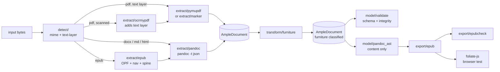
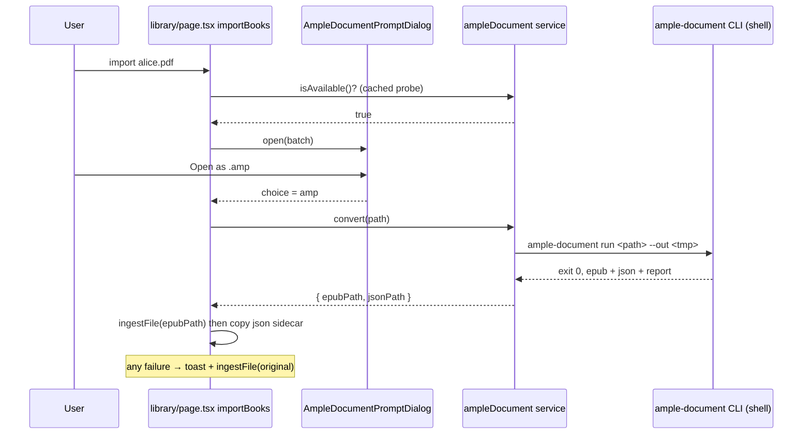

# feat: AmpleDocument vertical slice — ingest, furniture, EPUB export, foliate proof

**Target locations.** This plan spans two places in the fifthink workspace:

- `ample-document/` — a **new** Python package, sibling of `readest/` (paths below written as `ample-document/...`, relative to the workspace root).
- `readest/` — this repo (paths written repo-relative, e.g. `apps/readest-app/src/...`).

Source brief: `~/Downloads/ample-document-vertical-slice-prompt.md` (not in any repo; U1 copies it into the package as `docs/brief.md`).

## Summary

Build the canonical **AmpleDocument** model and the one pipeline every future Ampleread surface depends on: `input file → AmpleDocument JSON → EPUB 3 that foliate-js opens and navigates`. Ships as a standalone Python package with a CLI, a furniture-classification transform, schema/epubcheck/integrity validation, a test suite, generated TypeScript types, and a browser-level proof in Readest's own foliate-js fork. A thin Readest hook (the "Turbocharge your Experience" import dialog from the two Figma mocks) lets a desktop user route a PDF or EPUB through the CLI at import time.

---

## Problem Frame

Ampleread's later features (configurable web reader, HTML/DOCX export, audiobook, AI video, interactive/AR overlays, content-addressed storage) all need to reference the *same* document structure by stable block identity with provenance and explicit reading order. Nothing in the workspace provides that today: `amply-backend` has per-format parsers that emit chapters and passages for the older Amply pipeline, and Readest renders source files directly via foliate-js. The AmpleDocument schema is the single expensive-to-reverse decision, so it is designed first and treated as the contract; every other stage (detector, extractors, transform, exporter) is a replaceable adapter around it.

---

## Requirements

### Contract (model)

- R1. A JSON Schema (draft 2020-12) defines AmpleDocument exactly as the brief specifies: top-level `schema_version`, `id`, `pipeline`, `source`, `metadata`, `toc`, `blocks`; block fields `id`, `type`, `role`, `content`, `attrs`, `provenance`, `reading_order`, `children`; the full block-type and role enumerations; and a mark-based inline model.
- R2. TypeScript types and Python models are generated from that schema and checked in; a test fails when regenerated output drifts from the checked-in files.
- R3. Document `id` is a pure function of `sha256(source_bytes)` and `pipeline_version`; `created_at` never participates.
- R4. Block `id`s are non-empty, unique within a document, and identical across two runs of the same input at the same pipeline version.
- R5. An `AmpleDocument → Pandoc AST` mapping exists for content blocks (furniture dropped), and the inline model maps losslessly onto Pandoc `Inline` constructors for the marks in scope.

### Ingestion

- R6. Inputs PDF, EPUB, HTML, DOCX and Markdown are detected by content (not extension alone) and routed: PDF → text-layer detection → born-digital extraction or OCR-then-extraction; DOCX/MD/HTML → Pandoc AST → AmpleDocument; EPUB → package parse (spine, nav, metadata) → AmpleDocument.
- R7. PDF-sourced content blocks carry `provenance.page` and `provenance.bbox`; structured inputs carry `provenance.page` or `provenance.source_span` where derivable and `bbox: null` otherwise.
- R8. `reading_order` is a total order over content blocks: integers 0..N-1 with no gaps and no duplicates, independent of array position; furniture blocks carry `null` and are re-numbered out whenever the transform runs.
- R9. Ingestion is deterministic: same bytes + same pipeline version produce byte-identical AmpleDocument JSON after removing `pipeline.created_at`.
- R10. Ingestion performs no network I/O. OCR and the heavy extractor are separable, optional stages that fail loudly with an actionable message when their tool is absent.

### Cleanup transform

- R11. Running headers, running footers and page numbers are detected from repeated normalized text at consistent page positions (bbox band + page) and re-typed with `role: furniture`; nothing is deleted and the original `type` is retained so the change is reversible and auditable.
- R12. The transform is conservative: below-threshold matches stay `content`, every furniture decision is listed in the validation report, and the transform is a no-op on documents without bbox provenance.

### Export and validation

- R13. The exporter serializes `role: content` blocks in `reading_order` to XHTML + CSS, builds spine and EPUB nav from `toc`, and packages a valid EPUB 3 whose elements carry the block ids.
- R14. epubcheck reports zero errors on every exported EPUB in the test corpus.
- R15. A validation step checks schema conformity, block-id uniqueness, reading-order totality, provenance presence rules, and toc target resolution, and writes a per-input JSON report.
- R16. The exported EPUB opens in foliate-js, paginates, and its TOC entries navigate to the right sections (proved by an automated browser test in Readest).

### CLI and tests

- R17. One CLI runs the whole path on a single file or a folder and writes per input: the AmpleDocument JSON, the EPUB, and the validation report.
- R18. The test suite covers schema, determinism, Pandoc mapping round-trip, furniture classification, EPUB validity and a per-sample acceptance table.
- R19. Suggested layout is honored (`model/ detect/ extract/ transform/ export/ cli tests/`) so swapping an extractor touches only `extract/`.

### Readest hook (thin)

- R20. On desktop, when the `ample-document` CLI is available on PATH and the feature toggle is on, importing a PDF or EPUB shows the "Turbocharge your Experience" dialog with *Continue as .<ext>* and *Open as .amp*, matching the mocks.
- R21. *Open as .amp* runs the CLI, imports the produced EPUB as the library book, and keeps the AmpleDocument JSON as a sidecar in the book's storage directory. *Continue* and any failure fall back to the normal import path with a toast.
- R22. Web and mobile builds never show the dialog; nothing else in the import flow changes.

---

## Scope Boundaries

**Out of scope (from the brief; do not build, do not preclude):** AI video, LLM-based cleanup, interactivity/games/AR, audiobook/TTS, credit/billing, hosting/infra, the content-addressed storage layer, and Readest integration beyond the thin hook above plus "the EPUB opens in foliate".

**Also out of scope for this slice:** MOBI/AZW/FB2/TXT inputs; direct HTML/DOCX *export* (the Pandoc mapping makes them cheap later, but only EPUB ships); table-structure recovery from PDFs beyond what the extractor gives; multi-column reading-order inference beyond extractor output; any UI in Readest for browsing the AmpleDocument.

### Deferred to Follow-Up Work

- **What a `.amp` file is.** The mocks say "Open as .amp"; this slice treats it as "the ample-document pipeline output" and imports the EPUB. Defining `.amp` as a container (JSON + EPUB + assets), registering it as a Readest format, and syncing the sidecar to the cloud are follow-ups.
- Shipping the CLI with the desktop app as a Tauri sidecar instead of requiring it on PATH.
- Mobile/web routing through a hosted pipeline.
- Marker-based extraction for DOCX/EPUB/HTML (Marker `[full]` supports them) as an alternative to the Pandoc route.
- A "don't ask again / always" preference on the dialog.
- Per-sample acceptance rows for the user's own documents (table is seeded with Readest fixtures only).

---

## Key Technical Decisions

- **Standalone package at `ample-document/`, Python 3.12 via uv, `src/` layout:** keeps the contract free of FastAPI/Celery/Amply pipeline coupling in `amply-backend`, while staying in the language Marker, OCRmyPDF and PyMuPDF are native to. `amply-backend` is left untouched.
- **JSON Schema is the single source of truth; Python and TS types are generated artifacts:** Python models via `datamodel-code-generator` (pydantic v2 output), TypeScript via `json-schema-to-typescript` run through Node. Both outputs are checked in and drift-tested so the schema cannot silently diverge from either consumer.
- **Document id = `sha256(sha256_hex(bytes) + ":" + pipeline_version)`; `pipeline_version` = package version + extractor name + extractor version:** satisfies the brief's derivation while making "same input, same pipeline" the cache key. Switching extractors is a new pipeline version by construction.
- **Block id = `"b_" + sha256(document_id + ":" + structural_path)[:16]` where `structural_path` is the child-index path from the root (e.g. `12/0/3`):** unique by construction (paths are unique), stable whenever extraction is deterministic, and independent of text content so repeated paragraphs never collide. Text-hash ids were rejected for exactly that collision problem.
- **Inline model is a flat list of runs `{text, marks[]}` with mark kinds `emphasis | strong | code | superscript | subscript | strikeout | underline | smallcaps | link | footnote_ref`:** simpler to consume for renderers and TTS than nested trees, and mechanically convertible to Pandoc's nested `Inline` constructors (run-length grouping of marks) and back. Pandoc `Str`/`Space` tokenization is handled inside the mapping, not stored.
- **Pandoc is invoked as a subprocess (`pandoc -t json` / `-f json`), pinned to `pandoc-api-version` major 1.23:** pandoc 3.9 is installed here and emits `[1,23,1,1]`; the mapper refuses other majors with a clear error rather than mis-mapping.
- **PDF born-digital extraction has two adapters behind one interface:** `pymupdf` (default, always installed, font-size heuristics for headings, block bboxes) and `marker` (optional extra `[marker]`, richer typed blocks incl. `PageHeader`/`PageFooter`/`Footnote`/`Table`, polygon → bbox). The suite runs green without Marker; Marker tests skip when it is not installed. Marker is still the recommended extractor for real content, per the brief.
- **OCR is a separable preprocessing stage calling the `ocrmypdf` CLI (`--skip-text`, `--deskew`) into a temp file, then the same extraction path:** matches the brief's "keep OCR modular"; a missing binary raises `ToolMissingError` naming the install command.
- **EPUB ingest parses the package in Python (zipfile + ElementTree for container/OPF/nav) and pushes each spine XHTML through the Pandoc HTML route:** reuses one HTML→AmpleDocument path; `source_span` records the spine item href so "jump to source" works. foliate-js parsers stay on the render side only.
- **Furniture transform thresholds:** candidate blocks lie in the top or bottom 12% of the page height; normalized text (digits → `#`, whitespace collapsed, case-folded) must recur on ≥ max(3, 30% of pages) at a vertical position within 2% of page height; page numbers additionally require the raw text to be an integer/roman numeral/`Page N` and to increase across pages. Originals are kept in `attrs.original_type`; all decisions are logged. These are constants in one place so tuning does not touch logic.
- **Exporter is a block walker producing XHTML fragments, packaged by hand with `zipfile` (mimetype first, stored):** no `ebooklib`; the same walker is the seam for a future direct web render. Sections split at level-1 headings (single section when none). Footnotes emit `epub:type="noteref"`/`footnote`. Figures embed images from the source or Marker output.
- **epubcheck runs from a jar resolved via `EPUBCHECK_JAR` or `~/.cache/ample-document/epubcheck/`; a separate `ample-document tools install epubcheck` command downloads 5.3.0:** ingestion stays network-free; only the explicit tools command touches the network. Java 17 is present locally.
- **foliate proof lives in Readest's browser test lane (`vitest.browser.config.mts`, Playwright chromium) against a checked-in fixture EPUB the CLI produced:** the existing `DocumentLoader` + `paginator` tests already show how to open an EPUB and wait for `stabilized`; this reuses that instead of a separate harness in the Python repo.
- **Readest hook invokes the CLI through `@tauri-apps/plugin-shell` with a scoped capability entry (`cmd: "ample-document"`, args validated) and a boolean setting `ampleDocumentPromptEnabled`:** Tauri's shell scope needs a fixed command name, so requiring the CLI on PATH is simpler and safer than a user-editable path. Availability is probed once per library load with `ample-document --version`.
- **One dialog per import batch, not per file:** the label reads *Continue as .pdf* when the batch is a single file (as in the mocks) and *Continue as original files* otherwise, avoiding fifty prompts on a folder import.

---

## High-Level Technical Design

Pipeline routing and where each stage's seam sits:



Readest hook sequence on desktop:



Block id and document id derivation (directional):

```text
doc_id   = sha256( sha256_hex(source_bytes) + ":" + pipeline_version )
block_id = "b_" + sha256( doc_id + ":" + "/".join(child_indexes) )[:16]
reading_order assigned by a pass that runs after extraction and again after the furniture transform:
           0..N-1 over content blocks in extractor order; furniture blocks -> null
```

---

## Output Structure

```text
ample-document/
├── pyproject.toml                # uv-managed, python 3.12, extras: marker, dev
├── README.md
├── docs/brief.md                 # copy of the implementation prompt
├── src/ample_document/
│   ├── __init__.py               # PIPELINE_VERSION helpers
│   ├── model/
│   │   ├── schema/ampledocument.schema.json
│   │   ├── generated/ampledocument.py      # datamodel-codegen output
│   │   ├── generated/ampledocument.d.ts    # json-schema-to-typescript output
│   │   ├── ids.py                # doc/block id derivation, reading_order assignment
│   │   ├── inline.py             # run/mark helpers
│   │   ├── validate.py           # schema + integrity checks, report dataclass
│   │   └── pandoc_ast.py         # AmpleDocument <-> Pandoc AST
│   ├── detect/
│   │   ├── mime.py               # content sniffing
│   │   └── text_layer.py         # born-digital vs scanned
│   ├── extract/
│   │   ├── base.py               # Extractor protocol + ToolMissingError
│   │   ├── pymupdf.py
│   │   ├── marker.py
│   │   ├── ocrmypdf.py
│   │   ├── pandoc.py             # docx/md/html
│   │   └── epub.py
│   ├── transform/furniture.py
│   ├── export/
│   │   ├── epub.py               # block walker + packaging
│   │   ├── xhtml.py              # per-block serializers
│   │   └── epubcheck.py
│   ├── pipeline.py               # run(bytes, filename) -> Result
│   └── cli.py                    # `ample-document run|validate|tools`
├── scripts/gen_types.sh          # regenerate model/generated/*
└── tests/
    ├── fixtures/                 # copies of readest sample-alice.pdf/.epub, sample-paper.pdf, synthesized scanned pdf, small docx/md/html
    ├── test_schema.py
    ├── test_ids_determinism.py
    ├── test_pandoc_ast.py
    ├── test_extract_*.py
    ├── test_furniture.py
    ├── test_export_epub.py
    ├── test_cli.py
    └── test_acceptance_samples.py
```

---

## Implementation Units

### Phase A — the contract

### U1. Package scaffold, JSON Schema, generated types

**Goal:** Stand up `ample-document/` and author the AmpleDocument JSON Schema as the contract, with generated Python and TypeScript types and a drift guard.

**Requirements:** R1, R2, R19

**Dependencies:** none

**Files:**
- `ample-document/pyproject.toml`, `ample-document/README.md`, `ample-document/docs/brief.md`
- `ample-document/src/ample_document/__init__.py`
- `ample-document/src/ample_document/model/schema/ampledocument.schema.json`
- `ample-document/src/ample_document/model/generated/ampledocument.py`
- `ample-document/src/ample_document/model/generated/ampledocument.d.ts`
- `ample-document/scripts/gen_types.sh`
- `ample-document/tests/test_schema.py`

**Approach:** Schema encodes every field in the brief with `additionalProperties: false` on block and document objects, `$defs` for `Block`, `Inline`, `Mark`, `Provenance`, `TocEntry`, `Pipeline`, `Source`, `Metadata`, and a closed enum for `type`, `role` and mark kinds. `attrs` is an object whose allowed keys are constrained per type with `if/then` clauses for the required ones (heading `level`, list `ordered`, figure `src`). `provenance.bbox` is `[number]*4 | null`; `page` is `integer | null`; `source_span` is a free object. `schema_version` starts at `"1.0.0"`. Dev dependencies: pytest, jsonschema, datamodel-code-generator, ruff, mypy. Node is only needed to regenerate the `.d.ts` (`npx json-schema-to-typescript`), never at runtime. Generation script is idempotent; the drift test regenerates into a temp dir and diffs.

**Patterns to follow:** `amply-backend/pyproject.toml` for ruff/mypy strictness settings; the brief's field list verbatim.

**Test scenarios:**
- A minimal valid document (one heading, one paragraph) validates.
- Each invalid case fails with the field named: missing `role`; unknown block `type`; `bbox` with three numbers; `reading_order` as a string; unknown top-level key; heading without `attrs.level`.
- Nested `children` validate recursively (list → list_item → paragraph).
- Regenerating Python and TS types yields files byte-identical to the checked-in ones.

**Verification:** `pytest tests/test_schema.py` green; `scripts/gen_types.sh` leaves the tree clean.

---

### U2. Ids, reading order, inline model and Pandoc AST mapping

**Goal:** Implement the derivations that make the model stable, plus the bidirectional Pandoc AST mapping the ingest and export paths both rely on.

**Requirements:** R3, R4, R5, R8

**Dependencies:** U1

**Files:**
- `ample-document/src/ample_document/model/ids.py`
- `ample-document/src/ample_document/model/inline.py`
- `ample-document/src/ample_document/model/pandoc_ast.py`
- `ample-document/src/ample_document/model/validate.py` (integrity checks only; report shape)
- `ample-document/tests/test_ids_determinism.py`, `ample-document/tests/test_pandoc_ast.py`

**Approach:** `ids.py` exposes `document_id(source_sha256, pipeline_version)`, `assign_block_ids(doc)` (structural-path hash, applied after the tree is final) and `assign_reading_order(doc)` (depth-first over content blocks, furniture excluded, integers from 0). `pandoc_ast.py` maps: `Header→heading`, `Para/Plain→paragraph`, `BulletList/OrderedList→list/list_item`, `Table→table/table_row/table_cell`, `Figure→figure(+caption child)`, `BlockQuote→blockquote`, `CodeBlock→code`, `Note` inlines→`footnote` blocks with `footnote_ref` marks, `HorizontalRule`→dropped, `Div/Span` unwrapped with attrs kept in `attrs.pandoc_attr`. Reverse mapping emits a Pandoc JSON document whose `pandoc-api-version` matches the installed pandoc (major 1.23) and contains content blocks only. Inline runs ↔ Pandoc inlines via run-length grouping of identical mark sets. `validate.py` here only carries the integrity checks (unique ids, reading-order totality, toc target resolution, provenance rules per source kind) so U6 can add schema validation and the report writer.

**Execution note:** Implement the mapping test-first against small hand-written Pandoc JSON fixtures produced with the local `pandoc -t json`.

**Test scenarios:**
- Same source bytes + same pipeline version → identical `id`; different pipeline version → different `id`; `created_at` change → same `id`.
- Two runs of `assign_block_ids` on structurally equal trees give identical ids; sibling paragraphs with identical text get different ids.
- `assign_reading_order` on a tree with furniture blocks yields 0..N-1 over content blocks only; furniture blocks get `reading_order: null` (the schema allows null only when `role` is `furniture`).
- Pandoc `Header 2 "Intro"` → heading level 2; `Emph[Str a, Space, Strong[Str b]]` → runs `[a (emphasis)], [ (emphasis)], [b (emphasis,strong)]`; round-trip Ample → Pandoc → Ample is equal for every fixture.
- Ordered list with `start=3` preserves `attrs.start`; nested list nests `children`.
- A `Note` produces a `footnote` block with `attrs.ref_id` and a `footnote_ref` mark at the anchor.
- Mapping a document with an unsupported `pandoc-api-version` major raises with the version in the message.
- Integrity checks: duplicate id → error; reading-order gap → error; toc pointing at unknown block → error.

**Verification:** Both test files green; mypy clean on `model/`.

---

### Phase B — ingestion

### U3. Detection and structured ingest (DOCX, Markdown, HTML, EPUB)

**Goal:** Route inputs by sniffed type and produce AmpleDocuments from the structured formats via Pandoc, plus EPUB package parsing.

**Requirements:** R6, R7, R9, R10

**Dependencies:** U2

**Files:**
- `ample-document/src/ample_document/detect/mime.py`
- `ample-document/src/ample_document/extract/base.py`
- `ample-document/src/ample_document/extract/pandoc.py`
- `ample-document/src/ample_document/extract/epub.py`
- `ample-document/src/ample_document/pipeline.py` (routing skeleton)
- `ample-document/tests/fixtures/` (small `.docx`, `.md`, `.html`, `sample-alice.epub`)
- `ample-document/tests/test_extract_pandoc.py`, `ample-document/tests/test_extract_epub.py`

**Approach:** `mime.py` sniffs magic bytes (`%PDF`, zip + `mimetype`=epub, zip + `word/document.xml`, `<html`/`<!doctype`, else markdown when extension says so and bytes are UTF-8 text); extension is a tiebreaker only. `extract/base.py` defines the `Extractor` protocol (`extract(bytes, filename) -> AmpleDocument-without-ids`, plus `name`/`version` used in `pipeline_version`) and `ToolMissingError`. `extract/pandoc.py` writes bytes to a temp file, runs `pandoc -f <fmt> -t json`, maps via U2, and fills `metadata` from Pandoc `meta`. `extract/epub.py` reads `META-INF/container.xml` → OPF (metadata, manifest, spine) → nav/NCX → per spine item runs the HTML route, sets `provenance.source_span = {href, index}`, and builds `toc` by resolving nav hrefs (with fragments) to the first block from that item/anchor. `pipeline.py` composes detect → extract → `assign_block_ids` → `assign_reading_order` and records `pipeline`/`source`. Pandoc `--resource-path` is limited to the temp dir; no network.

**Patterns to follow:** `amply-backend/app/services/preparation/parsers/format_detector.py` for detection shape (but content-first here); Pandoc JSON as observed locally (`pandoc-api-version [1,23,1,1]`).

**Test scenarios:**
- Sniffing: PDF bytes with `.txt` name → pdf; EPUB zip → epub; DOCX zip → docx; HTML text → html; markdown text with `.md` → markdown; unknown binary → `UnsupportedInputError`.
- Markdown with headings, emphasis, a link, a list and a code block → matching block types, marks and `attrs`; `provenance.bbox` is null and `page` is null.
- DOCX fixture with two heading levels → `toc` derived from headings (level 1 and 2) when no explicit outline exists.
- `sample-alice.epub` → metadata title/author from OPF; blocks in spine order; every toc entry resolves to a block whose `source_span.href` matches the nav href; `source_span` present on every block.
- Determinism: extracting the same fixture twice yields identical JSON after dropping `created_at`.
- Pandoc missing from PATH → `ToolMissingError` naming `pandoc`.

**Verification:** Both extractor tests green; `pipeline.run` on each structured fixture validates under U1's schema.

---

### U4. PDF ingest: text-layer detection, PyMuPDF and Marker extractors, OCRmyPDF stage

**Goal:** Produce AmpleDocuments with page + bbox provenance from born-digital and scanned PDFs, with the extractor and OCR stages as swappable adapters.

**Requirements:** R6, R7, R9, R10

**Dependencies:** U3

**Files:**
- `ample-document/src/ample_document/detect/text_layer.py`
- `ample-document/src/ample_document/extract/pymupdf.py`
- `ample-document/src/ample_document/extract/marker.py`
- `ample-document/src/ample_document/extract/ocrmypdf.py`
- `ample-document/src/ample_document/pipeline.py` (PDF branch)
- `ample-document/tests/fixtures/` (`sample-alice.pdf`, `sample-paper.pdf`, `scanned-alice.pdf` synthesized by rasterizing pages of `sample-alice.pdf` with PyMuPDF at build time of the fixture and committing the result)
- `ample-document/tests/test_extract_pdf.py`

**Approach:** `text_layer.py` opens with PyMuPDF and computes per-page extractable character counts; a PDF is born-digital when ≥ 80% of pages have ≥ 50 characters (constants live together). `pymupdf.py` uses `page.get_text("dict")`: each text block becomes a `paragraph` (lines joined, hyphenation at line end left as-is), blocks whose dominant font size exceeds the document's body size by a tiered ratio become `heading` level 1–3, image blocks become `figure` with the image extracted to `attrs.src` (data URI or sidecar name), and every block gets `provenance = {page, bbox}` in PDF points. `marker.py` imports lazily inside the function; maps Marker's JSON tree (`Page` → children; `SectionHeader`→heading with level from `section_hierarchy`, `Text`/`TextInlineMath`→paragraph, `ListGroup/ListItem`→list/list_item, `Table/TableCell`→table..., `Figure/Picture`→figure, `Caption`→caption, `Footnote`→footnote, `Code`→code, `PageHeader`/`PageFooter`→ blocks typed `running_header`/`running_footer` but **still `role: content`** so the transform in U5 makes the furniture decision) and converts the polygon to a bbox. Marker's inline HTML is parsed into runs (b/i/sup/sub/a/code). Marker page images are used as figure sources. `ocrmypdf.py` runs the CLI with `--skip-text --deskew --output-type pdf` into a temp file and returns the new bytes; the pipeline then re-runs detection and extraction, and records `pipeline.extractor` as `"ocrmypdf+<extractor>"`. Extractor selection: CLI flag `--extractor auto|pymupdf|marker`; `auto` picks marker when importable, else pymupdf.

**Patterns to follow:** `amply-backend/app/services/preparation/parsers/pdf_parser.py` for the marker/pymupdf split (but no silent fallback here: `auto` chooses up front and logs which one ran).

**Test scenarios:**
- `sample-alice.pdf` → born-digital; `scanned-alice.pdf` → scanned; a one-page text PDF with an all-image second page → born-digital (threshold behaviour).
- PyMuPDF extraction of `sample-alice.pdf`: every block has `page ≥ 1` and a 4-number `bbox` within page bounds; at least one heading and many paragraphs; reading order increases page by page.
- `sample-paper.pdf`: headings detected for the section titles; figures present with `attrs.src`.
- Determinism: two PyMuPDF runs produce identical JSON minus `created_at`; ids identical.
- Scanned fixture with `ocrmypdf` missing → `ToolMissingError` mentioning `ocrmypdf`; with a stubbed `ocrmypdf` that returns the born-digital file → pipeline proceeds and `pipeline.extractor` starts with `ocrmypdf+`.
- Marker adapter: unit-tested against a small checked-in Marker JSON sample (no model download), covering the type map, bbox conversion, inline HTML → runs; the live Marker test is skipped when `marker` is not importable.
- `--extractor marker` without Marker installed → `ToolMissingError` naming the `[marker]` extra.

**Verification:** `pytest tests/test_extract_pdf.py` green without Marker or OCRmyPDF installed; the same file passes with them installed (manual check, recorded in README).

---

### Phase C — transform and export

### U5. Furniture classification transform

**Goal:** Classify running headers, footers and page numbers as furniture from positional repetition, conservatively, reversibly, with an audit log.

**Requirements:** R11, R12

**Dependencies:** U4

**Files:**
- `ample-document/src/ample_document/transform/furniture.py`
- `ample-document/tests/test_furniture.py`
- `ample-document/tests/fixtures/` (a generated 12-page PDF with running header "Alice in Wonderland", footer "Chapter I", and centered page numbers, built with PyMuPDF and committed)

**Approach:** Operates purely on the model: collect leaf text blocks with bbox; compute page height per page from provenance (max bbox y1 per page, or `source.page_size` when the extractor recorded it); candidates are blocks whose bbox lies within the top or bottom band; group by normalized text (digits → `#`, whitespace collapsed, case-folded, punctuation trimmed); a group is a running header/footer when it appears on ≥ max(3, 30% of pages) with vertical centre variance within 2% of page height; page-number candidates are groups whose raw texts parse as integers or roman numerals (or `Page N`) whose parsed values are strictly increasing with page index for at least 3 pages. Matches get `role: furniture`, `type` set to `running_header`/`running_footer`/`page_number`, `attrs.original_type` and `attrs.original_reading_order` retained, and the pipeline re-runs `assign_reading_order` so content blocks stay contiguous. An entry `{block_id, reason, page, band, group_size}` is appended to a `TransformLog` that the report writer (U6) persists. Documents with no bbox provenance return unchanged with a log note. Thresholds are module constants.

**Execution note:** Test-first with the synthetic furniture PDF so thresholds are pinned by tests before touching real samples.

**Test scenarios:**
- Synthetic 12-page PDF: header, footer and page-number blocks on every page become furniture with the right types; body paragraphs remain `content`; count of furniture blocks = 3 × pages.
- Reversibility: restoring `type`/`reading_order` from `attrs.original_*` and `role: content` yields the pre-transform document.
- A phrase repeated in the body (middle of the page) on every page stays `content` (band rule).
- A header present on only 2 of 12 pages stays `content` (minimum-count rule).
- Page numbers that are not monotonic (e.g. repeated "1") stay `content`.
- Document from Markdown (no bbox) → unchanged; log contains the "no positional provenance" note.
- After the transform, content blocks' `reading_order` is exactly 0..N-1 and every furniture block has `reading_order: null`.

**Verification:** `pytest tests/test_furniture.py` green; running the transform on `sample-paper.pdf` classifies nothing wrongly on visual inspection of the log (record findings in the acceptance table in U7).

---

### U6. EPUB 3 exporter, epubcheck runner, validation report

**Goal:** Turn the content flow into a valid EPUB 3 with nav from `toc`, verify it with epubcheck, and emit the per-input validation report.

**Requirements:** R13, R14, R15

**Dependencies:** U2, U5

**Files:**
- `ample-document/src/ample_document/export/xhtml.py`
- `ample-document/src/ample_document/export/epub.py`
- `ample-document/src/ample_document/export/epubcheck.py`
- `ample-document/src/ample_document/model/validate.py` (schema validation + report writer added)
- `ample-document/tests/test_export_epub.py`

**Approach:** `xhtml.py` is the block walker: one serializer per block type, each emitting an element with `id="{block.id}"`, marks → `em/strong/code/sup/sub/s/u/span.smallcaps/a`, footnotes as `<aside epub:type="footnote">` with `<a epub:type="noteref">` at the anchor, figures as `<figure><figcaption>`, tables as real `<table>` markup, `page_break` as an empty `<span epub:type="pagebreak">` only when it is content. Furniture blocks are skipped by the walker (the walker takes a predicate so a future audiobook projection can reuse it). `epub.py` splits sections at level-1 headings, writes `mimetype` (stored, first), `META-INF/container.xml`, `OEBPS/package.opf` (dc metadata from `metadata`, `dcterms:modified` fixed to `created_at`), `OEBPS/nav.xhtml` from `toc` (hrefs = section file + `#block_id`), one XHTML per section, `style.css`, and image assets. `epubcheck.py` locates the jar (`EPUBCHECK_JAR` env → cache dir), runs `java -jar epubcheck.jar <file> --json <out>`, and parses messages into `{errors, warnings}`. `validate.py` gains `validate_schema(doc)` via `jsonschema` and `write_report(path, ...)` combining schema result, integrity result, transform log and epubcheck result into one JSON.

**Test scenarios:**
- Exporting the alice AmpleDocument yields a zip whose first entry is `mimetype`, stored, with the exact EPUB media type; `container.xml` points at the OPF; every spine item exists in the manifest.
- Every content block id appears exactly once as an element id in the XHTML; no furniture block id appears anywhere.
- nav.xhtml has one `li` per `toc` entry, each href resolving to an existing file and fragment.
- Marks render to the expected elements (a paragraph with emphasis+link renders `<em><a href>`), and a footnote renders `noteref` + `footnote` aside pair.
- XHTML output is well-formed XML for every fixture (parse with ElementTree).
- epubcheck on each fixture's export reports zero errors (test skipped with a clear reason when the jar is absent; CI/README instructs `tools install epubcheck`).
- Report file contains all four sections and `ok: true` for a clean run; a document with a duplicated id produces `ok: false` and names the id.

**Verification:** `pytest tests/test_export_epub.py` green with the jar installed; a produced EPUB opens in Readest by manual drag-in (sanity before U8 automates it).

---

### Phase D — CLI, corpus and foliate proof

### U7. CLI, folder runs, determinism and per-sample acceptance suite

**Goal:** Ship the end-to-end command and the acceptance corpus that proves the brief's criteria.

**Requirements:** R9, R17, R18

**Dependencies:** U6

**Files:**
- `ample-document/src/ample_document/cli.py`
- `ample-document/tests/test_cli.py`, `ample-document/tests/test_acceptance_samples.py`
- `ample-document/README.md` (usage, tool install, extras)

**Approach:** `ample-document run <file|dir> --out <dir> [--extractor auto|pymupdf|marker] [--no-furniture] [--skip-epubcheck]` writes, per input, `<stem>.ampledoc.json`, `<stem>.epub`, `<stem>.report.json`, and prints a one-line summary per file plus a non-zero exit when any report is not ok. `ample-document validate <ampledoc.json>` runs schema + integrity only. `ample-document tools install epubcheck` downloads the 5.3.0 zip into the cache dir (the only network path). `ample-document --version` prints package and pipeline version (used by the Readest probe). Folder runs process files sequentially in sorted order for deterministic output. Acceptance test parametrizes over the fixture corpus with a table (input type, born-digital/scanned, expected block-type coverage, expected furniture, structure that must survive) and is the place to add the user's samples later.

**Test scenarios:**
- Single-file run on `sample-alice.pdf` writes the three outputs and exits 0; the JSON validates; the EPUB passes epubcheck.
- Folder run over the fixture corpus writes outputs for every file, skips unsupported files with a listed warning, and exits 0.
- Determinism: two runs into different out dirs produce identical `.ampledoc.json` after removing `created_at`, and identical EPUB member contents.
- A deliberately broken input (truncated PDF) produces a report with `ok: false` and exit 1; other files in the same folder still complete.
- `--extractor marker` without Marker → exit 2 with the install hint.
- Acceptance rows: alice PDF (born-digital, headings+paragraphs, no furniture expected); paper PDF (born-digital, headings+figures+captions, running header/page numbers expected as furniture when present); synthetic furniture PDF (3 furniture kinds); scanned alice (requires ocrmypdf; skipped when missing); alice EPUB (toc resolves, spine order kept); md/docx/html mini-fixtures (marks, lists, code).

**Verification:** `uv run pytest` green locally without Marker/OCRmyPDF (skips reported), and with epubcheck installed; README documents both configurations.

---

### U8. foliate-js proof in Readest's browser test lane

**Goal:** Prove automatically that a CLI-produced EPUB opens, paginates and navigates in the foliate-js fork Readest ships.

**Requirements:** R16

**Dependencies:** U7

**Files:**
- `apps/readest-app/src/__tests__/fixtures/data/ample-alice-export.epub` (produced by U7's CLI from `sample-alice.pdf`; committed)
- `apps/readest-app/src/__tests__/document/ample-document-export.browser.test.ts`

**Approach:** Mirror `paginator-stabilization.browser.test.ts`: fetch the fixture, open via `DocumentLoader`, mount the paginated renderer, wait for `stabilized`, then assert: the book's `toc` has the expected entries; `goTo` on the second toc entry lands in a section whose first element id equals the block id from the toc href; `getContents().length` increases after paging; no console errors. Keep the fixture small (Alice sample is already used) so the browser lane stays fast.

**Test scenarios:**
- Book opens and `sections.length ≥ 1`; metadata title matches the AmpleDocument metadata.
- Paginated renderer reaches `stabilized` and renders at least two pages.
- Navigating to the second and last TOC entries resolves to the expected fragment ids; the visible heading text matches the toc title.
- Element ids in the rendered document equal AmpleDocument block ids (spot-check three ids from the checked-in JSON alongside the fixture).

**Verification:** `pnpm test:browser -- ample-document-export` passes headless; the existing browser suite stays green.

---

### Phase E — Readest thin hook

### U9. "Turbocharge your Experience" import dialog and CLI bridge

**Goal:** Let a desktop user choose *Open as .amp* at import time and route the file through the CLI, without changing the default import path.

**Requirements:** R20, R21, R22

**Dependencies:** U7 (CLI contract: `--version`, `run --out`)

**Files:**
- `apps/readest-app/src/services/ampleDocument/ampleDocumentService.ts` (probe availability, run conversion, locate outputs)
- `apps/readest-app/src/app/library/components/AmpleDocumentPromptDialog.tsx`
- `apps/readest-app/src/app/library/page.tsx` (`importBooks` branch)
- `apps/readest-app/src/types/settings.ts`, `apps/readest-app/src/services/constants.ts` (`ampleDocumentPromptEnabled` default `true` on desktop)
- `apps/readest-app/src/components/settings/ControlPanel.tsx` (toggle under Interface/Advanced)
- `apps/readest-app/src-tauri/capabilities/desktop.json` (shell scope entry for `ample-document`)
- `apps/readest-app/src/__tests__/app/library/ampleDocumentPromptDialog.test.tsx`, `apps/readest-app/src/__tests__/services/ampleDocumentService.test.ts`

**Approach:** The service wraps `Command.create('ample-document', [...])` from `@tauri-apps/plugin-shell`; `isAvailable()` runs `--version` once and caches the result for the session, returning false on web/mobile (`appService.isDesktopApp` guard) or when the toggle is off. `convert(filePath)` runs `run <file> --out <tmpDir> --skip-epubcheck` (epubcheck is a dev-time gate; the app trusts the pipeline's own validation and falls back on non-zero exit), then returns the EPUB and JSON paths from the out dir. In `importBooks`, before processing, if the service is available and at least one selected file is PDF/EPUB, await the dialog's choice for the batch; on `amp`, each eligible file is converted and `ingestFile` receives the EPUB path (with `forceCopy` so the temp file is copied into `Books/<hash>/`), after which the JSON is copied next to it as `ample-document.json`; on failure, toast and ingest the original. The dialog reuses `Dialog` with the mock's copy (title, subtitle, primary `Continue as .pdf` / `Continue as original files`, secondary `Open as .amp`), dark-surface styling consistent with the library popovers. Capability entry: `{ "name": "ample-document", "cmd": "ample-document", "args": [ { "validator": "^(run|--version)$" }, ... ] }` with `sidecar: false`. i18n keys are added with English fallback; translation sweep deferred (existing convention).

**Patterns to follow:** `src/components/UpdaterWindow.tsx` for `Command.create` usage; `src-tauri/capabilities/default.json` shell scope entries; `TelemetryConsentDialog.tsx` for a `Dialog`-based prompt; `uiAnimationsEnabled` for adding a setting + ControlPanel switch; `importMenu.test.tsx` for the jsdom test style.

**Test scenarios:**
- Dialog renders the title, subtitle and both buttons; single-file batch shows `Continue as .pdf`; mixed batch shows `Continue as original files`; clicking each resolves the promise with `continue` / `amp`.
- Service: `isAvailable()` is false when `isDesktopApp` is false, false when the toggle is off, false when `--version` fails, true (and cached) when it succeeds.
- `convert` returns the EPUB and JSON paths when the command exits 0 and both files exist; rejects with the stderr excerpt on non-zero exit.
- `importBooks` with choice `amp`: `ingestFile` is called with the EPUB path and `forceCopy: true`, then the sidecar copy runs; with choice `continue`: the original path is ingested and the service is never invoked; on conversion failure: a toast fires and the original is ingested.
- Non-eligible batches (only `.txt`) never open the dialog even when available.

**Verification:** Targeted vitest files green; `pnpm lint` clean; manual check in the desktop dev build: importing `sample-alice.pdf` with the CLI on PATH shows the dialog and *Open as .amp* lands an EPUB in the library that opens in the reader.

---

## Risks and Mitigations

- **Marker install weight and Python compatibility.** Marker pulls torch and downloads model weights on first use; Python 3.14 is the default `python3` here. Mitigation: uv pins 3.12; Marker is an extra; the suite and the Readest proof do not depend on it.
- **Extractor nondeterminism.** Marker's model inference may not be bit-stable across runs, which would break block-id stability for that extractor. Mitigation: ids are structural, determinism tests run on the PyMuPDF path, and a Marker determinism test is marked expected-flaky until measured; `pipeline_version` isolates the two extractors.
- **OCR quality on the synthesized scanned fixture.** Tesseract output may differ from the born-digital text. Mitigation: the scanned acceptance row asserts structure (page count, provenance, non-empty paragraphs), not exact text.
- **Pandoc API drift.** A future pandoc bump changes `pandoc-api-version`. Mitigation: explicit major check with a clear error; the version is recorded in `pipeline.extractor_version`.
- **epubcheck requires Java.** Java 17 is present locally; CI would need it. Mitigation: tests skip with a reason when the jar/Java is absent and the README says how to install.
- **Tauri shell scope.** A wrong validator blocks the command silently. Mitigation: the service surfaces stderr/exit codes in the toast and the unit tests cover the args shape used.
- **Browser fixture size.** Committing EPUBs bloats the repo. Mitigation: only the Alice export (small) is committed; other fixtures live in the Python repo.

---

## Deferred Implementation Notes

- Exact heading-size tiers for the PyMuPDF extractor and the furniture thresholds will be tuned against the fixtures during implementation; the plan fixes their *location* (module constants) not their final values.
- Whether the temp out dir for the Readest hook lives under Readest's app cache or the OS temp dir depends on what `appService.fs` exposes on each desktop platform; decide when wiring U9.
- Marker inline HTML edge cases (math, nested spans) will be handled as they appear in the checked-in Marker sample.
- Section splitting for documents with no headings but many pages may need a size cap to keep foliate pagination responsive; decide after measuring the paper fixture.

---

## Sources and Research

- Brief: `~/Downloads/ample-document-vertical-slice-prompt.md` (copied to `ample-document/docs/brief.md` in U1).
- Mocks: two Figma frames of the library "Turbocharge your Experience" dialog (Continue as pdf / epub, Open as .amp) supplied in the planning session.
- Local tooling verified: pandoc 3.9.0.2 (`pandoc-api-version [1,23,1,1]`), Java 17, uv with CPython 3.12 available, tesseract present; epubcheck, ocrmypdf and marker absent.
- Marker JSON format and block types: github.com/datalab-to/marker README (block types incl. `PageHeader`, `PageFooter`, `SectionHeader`, `Footnote`, `Table`; `--output_format json`; Python 3.10+; `[full]` extra for non-PDF).
- epubcheck 5.3.0 is the current release with `--json` output.
- Readest patterns: `apps/readest-app/src/app/library/page.tsx` (`importBooks`), `src/services/ingestService.ts`, `src/components/UpdaterWindow.tsx` (shell `Command`), `src-tauri/capabilities/default.json` (shell scope), `src/__tests__/document/paginator-stabilization.browser.test.ts` (foliate browser test shape), `vitest.browser.config.mts`.
- Prior art in workspace: `amply-backend/app/services/preparation/parsers/pdf_parser.py` (marker/pymupdf split) — patterns only, not reused.
